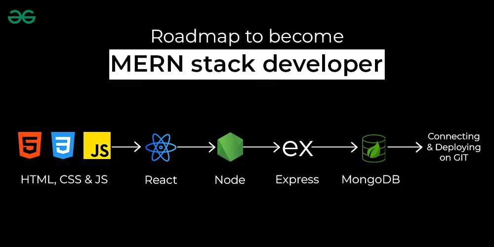

<div align="center">

<h1>🛡️ SecureBlog: Security by Design ⚛️</h1>

</div>

---

## 📑 Table of Contents

✨ 1. [**Introduction**](#-1-introduction)<br>
💻 2. [**Setting Up the Project Locally**](#-2-setting-up-the-project-locally)<br>
✅ 3. [**Features and Functionality**](#-3-features-and-functionality)<br>
🏗️ 4. [**Architecture**](#️-4-architecture)<br>
👥 5. [**Author and Contributions**](#-5-author-and-contributions)<br>
⚖️ 6. [**MIT License**](#️-6-mit-license)<br>
❓ 7. [**Frequently Asked Questions (FAQ)**](#-7-frequently-asked-questions-faq)<br>
📚 8. [**References**](#-8-references)<br>

---

## ✨ 1. Introduction

The **Secure Blog** is a **back-end** heavy **blog application** built on the **MERN stack (MongoDB, Express, React, Node.js)**. It serves as a practical vehicle for applying core concepts of **Application Development Security** in a real-world context. The project is specifically designed to implement and demonstrate **web application security principles**, focusing on the secure handling of user identities and user-generated content. Key security areas covered include building secure authentication and session handling, enforcing robust access control, and mitigating common web threats to protect against risks like content injection and unauthorized edits. By the end, the application showcases a strong foundation in security-first development and DevSecOps practices.

### Highlighted Technical Features ✨

- **Full-stack implementation** using the **MERN (MongoDB, Express, React, Node.js)** stack.
- **Secure User Authentication and Registration**, including password hashing and salting using bcrypt.
- **Protection against brute-force attacks** on the login route using express-brute.
- **Session control** managed via secure, expiring JSON Web Tokens (JWT) for all authenticated actions.
- Implementation of **Access Control** to ensure users can only perform CRUD (Create, Read, Update, Delete) operations on their own blog posts.
- Mandatory **Input Validation and Output Sanitization** to protect against malicious user-generated content.
- Comprehensive **mitigation strategies** for common web vulnerabilities, including **Cross-Site Scripting (XSS), SQL Injection (SQLi), Cross-Site Request Forgery (CSRF)**, and **clickjacking**.
- Preparation for secure deployment using **HTTPS with SSL certificates**.
- Configuration for consistent development and deployment environments using **Docker and Docker Compose**.

---

## 💻 2. Setting Up the Project Locally

### Prerequisites

To successfully compile and run this project, you must have the following installed on your system:

- **Operating Systems**: The project is built on cross-platform technologies and is designed to run consistently across any major operating system.

  - Cross-Platform (Windows, macOS, or Linux).
  - Prerequisite Software:
    - Node.js Runtime: A modern, maintained version of Node.js (e.g., version 18.x or newer is generally recommended for the dependency versions used).
    - NPM or Yarn: A package manager (NPM is implied by `package.json` and `package-lock.json`).
    - MongoDB: A locally running or cloud-hosted instance of the MongoDB database.
    - Docker & Docker Compose: Required if you choose to run the application using the containerized method.

- **IDE**: VS Code (Visual Studio Code) or any modern code editor with JavaScript/Node.js support (e.g., WebStorm, Atom, Sublime Text).
- **Version Control**: Git for cloning the repository.
- **RAM**: Minimum 4GB
- **Disk Space**: Minimum 200MB free space

- **Frameworks and Core Technologies**
  - Backend Runtime: Node.js (Version not explicitly listed, but the dependencies suggest a modern release, likely v18 or newer).
  - Backend Web Framework: Express: `^5.1.0`
  - Frontend UI Library: React: `^19.1.0`
  - Frontend Build Tool: Vite: `^7.0.4`
  - Database ODM: Mongoose: `^8.17.0` (backend) / `^8.16.5` (backend)

### Project Configurations

#### Environment Configuration File

This project uses environment variables to manage configuration for both the backend and the frontend.

`secureblog-backend\.env`

```console
PORT=5000
MONGO_URI=your_mongodb_connection_string_here
JWT_SECRET=your_jwt_secret_here
```

`secureblog-frontend\.env`

```console
VITE_API_URL=your_backend_api_url_here
```

#### Manifest Files

> ⚠️ **Note**: The versions listed are the minimum version plus acceptable updates, as indicated by the `^` symbol in the `package.json` files. For a deterministic installation, the exact locked versions are in the `package-lock.json` file.

`SecureBlog\package.json`

```json
{
  "dependencies": {
    "bcrypt": "^6.0.0",
    "cors": "^2.8.5",
    "dotenv": "^17.2.1",
    "express": "^5.1.0",
    "helmet": "^8.1.0",
    "jsonwebtoken": "^9.0.2",
    "mongoose": "^8.17.0"
  }
}
```

`secureblog-backend\package.json`

```json
{
  "name": "secureblog-backend",
  "version": "1.0.0",
  "main": "server.js",
  "scripts": {
    "dev": "nodemon server.js",
    "start": "node server.js",
    "test": "cross-env NODE_ENV=test jest",
    "lint": "eslint ."
  },
  "keywords": [],
  "author": "",
  "license": "ISC",
  "description": "",
  "dependencies": {
    "axios": "^1.11.0",
    "bcrypt": "^6.0.0",
    "cors": "^2.8.5",
    "dotenv": "^17.2.1",
    "express": "^5.1.0",
    "express-rate-limit": "^8.1.0",
    "express-validator": "^7.2.1",
    "helmet": "^8.1.0",
    "jsonwebtoken": "^9.0.2",
    "mongoose": "^8.16.5",
    "react-router-dom": "^7.7.1"
  },
  "devDependencies": {
    "cross-env": "^10.0.0",
    "eslint": "^8.57.1",
    "eslint-config-standard": "^17.1.0",
    "eslint-plugin-import": "^2.32.0",
    "eslint-plugin-n": "^16.6.2",
    "eslint-plugin-node": "^11.1.0",
    "eslint-plugin-promise": "^7.2.1",
    "eslint-plugin-standard": "^4.1.0",
    "jest": "^30.1.3",
    "nodemon": "^3.1.10",
    "supertest": "^7.1.4"
  }
}
```

`secureblog-frontend\package.json`

```json
{
  "name": "secureblog-frontend",
  "private": true,
  "version": "0.0.0",
  "type": "module",
  "scripts": {
    "dev": "vite",
    "build": "vite build",
    "lint": "eslint .",
    "preview": "vite preview"
  },
  "dependencies": {
    "axios": "^1.11.0",
    "react": "^19.1.0",
    "react-dom": "^19.1.0",
    "react-router-dom": "^7.8.0"
  },
  "devDependencies": {
    "@eslint/js": "^9.30.1",
    "@types/react": "^19.1.8",
    "@types/react-dom": "^19.1.6",
    "@vitejs/plugin-react": "^4.6.0",
    "eslint": "^9.30.1",
    "eslint-plugin-react-hooks": "^5.2.0",
    "eslint-plugin-react-refresh": "^0.4.20",
    "globals": "^16.3.0",
    "vite": "^7.0.4"
  }
}
```

### Installation

The SecureBlog application is split into two services: `secureblog-backend` (Node/Express API) and `secureblog-frontend` (React/Vite UI). Both services are configured to run over **HTTPS** for local development security.

#### 1. Prerequisites

You must have the following software installed on your machine:

- **Git**: For cloning the repository.
- **Node.js & npm**: A modern, stable version (LTS recommended).
- **MongoDB**: A locally installed instance or a cloud cluster (e.g., **MongoDB Atlas**).
- **OpenSSL (or Git Bash)**: Required to generate the **self-signed SSL certificate** for local HTTPS.

#### 2. Get the Codebase

First, clone the repository and navigate into the project directory:

```bash
# Clone the repository
git clone https://github.com/singhishkar108/SecureBlog.git

# Navigate into the project folder
cd SecureBlog
```

#### 3. Backend Setup (`secureblog-backend`)

The backend is the Express.js API responsible for routing, database interaction, and authentication.

1. Install Dependencies

- Navigate to the backend directory and install the necessary packages:

```bash
cd secureblog-backend
npm install
```

2. Configure Environment Variables

- Create a file named `.env` in the `secureblog-backend/` directory. This file holds your database credentials and secret keys.

```text
# Backend server port
PORT=5000

# MongoDB Connection String (Replace with your actual URI)
MONGO_URI=mongodb+srv://<dbUser>:<dbPassword>@cluster0.mongodb.net/secureblog

# Secret key for signing JSON Web Tokens (JWT)
JWT_SECRET=supersecretjwtkey_replace_this_in_production
```

3. Set up Local HTTPS (SSL Certificate)

- For local development security, the backend uses HTTPS and requires a self-signed certificate.

  3.1. **Create an `ssl` folder** inside `secureblog-backend/`:

  ```bash
  mkdir ssl
  ```

  3.2. **Create a configuration file** named `openssl.cnf` inside the `ssl` folder. This configures the certificate for `localhost`:

  ```ini
  [req]
  distinguished_name = req_distinguished_name
  x509_extensions = v3_req
  prompt = no

  [req_distinguished_name]
  C = XX
  ST = State
  L = City
  O = Organization
  OU = Development
  CN = localhost

  [v3_req]
  keyUsage = digitalSignature, keyEncipherment
  extendedKeyUsage = serverAuth
  subjectAltName = @alt_names

  [alt_names]
  DNS.1 = localhost
  ```

  3.3. **Generate the Certificate**: Run the following command (using OpenSSL or Git Bash) from the `secureblog-backend/` directory to generate the key and certificate files:

  ```bash
  openssl req -x509 -nodes -days 365 -newkey rsa:2048 -keyout ssl/privatekey.pem -out ssl/certificate.pem -config ssl/openssl.cnf -extensions v3_req
  ```

  This will create `privatekey.pem` and `certificate.pem` in the `ssl/` folder.

#### 4. Frontend Setup (`secureblog-frontend`)

The frontend is the React application built with Vite.

1. Install Dependencies

- Navigate to the frontend directory and install the necessary packages:

```bash
cd ../secureblog-frontend
npm install

# Additional packages for routing and API calls
npm install axios react-router-dom
```

2. Share SSL Certificate

- The frontend also needs the certificate to serve over HTTPS. Copy the generated certificate files from the backend:

```bash
# Ensure you are in secureblog-frontend/
mkdir ssl
cp ../secureblog-backend/ssl/*.pem ssl/
```

### Running

To ensure the application functions correctly, you must start both the backend API and the frontend UI concurrently in separate terminal windows/tabs.

#### 1. Start the Backend API (SecureBlog Server)

The backend runs on Node.js using the Express framework and connects to your MongoDB instance. It serves the API on port `5000`.

**Navigate to the Backend Directory:**

```bash
cd SecureBlog/secureblog-backend
```

**Run the Server in Development Mode:**
Use `npm run dev`, which starts the server using **nodemon** (a utility that automatically restarts the server when code changes are detected).

```bash
npm run dev
```

**Verification:**
Look for a message similar to the following in your console:

```
> nodemon server.js
[nodemon] starting `node server.js`
Secure API running at https://localhost:5000
Connected to MongoDB successfully!
```

Leave this terminal window open; the backend is now running and listening for API requests.

#### 2. Start the Frontend UI (React Application)

The frontend is built with React and uses Vite for rapid development. It serves the user interface, typically on port `5173`.

**Open a New Terminal Window/Tab.**

**Navigate to the Frontend Directory:**

```bash
cd SecureBlog/secureblog-frontend
```

**Run the Development Server:**

```bash
npm run dev
```

**Verification:**
Vite will compile the React code and start the development server. The console will display the local network addresses:

```
> vite
VITE v7.0.4  ready in 123 ms

➜  Local:   https://localhost:5173/
➜  Network: use --host to enable
```

#### 3. Access the Application

Open your web browser and navigate to the local address provided by the frontend server: `https://localhost:5173`

**Handle the SSL Warning:**
Since you are using a **self-signed SSL certificate** for secure local development, your browser will initially display a security warning (e.g., "**Your connection is not private**"). You must click the option to **proceed or trust the certificate locally** to view the application.

The SecureBlog login/registration page should now be visible. You can interact with the frontend, which will communicate securely with the backend API running on `https://localhost:5000`.

#### Alternative: Running with Docker Compose

If you configured **Docker** and the `docker-compose.yml` file as suggested in the project structure, you can start both services with a single command from the root `SecureBlog/` directory:

**Navigate to the Root Directory:**

```bash
cd SecureBlog/
```

**Build and Run the Services:**

```bash
docker-compose up --build
```

**Access:** The application will be accessible at the port mapped in your Docker Compose file (e.g., `http://localhost:3000` or `https://localhost:5173`, depending on your exact configuration).

---

## ✅ 3. Features and Functionality

### 1. Authentication and Access Control

This is a critical, security-focused area implemented in the `secureblog-backend`:

- **User Registration**: Allows new users to register with a username, email, and password.
- **Secure Login**: Users log in to receive a **secure JSON Web Token (JWT)** for session handling.
- **Password Hashing**: Passwords are never stored in plaintext; they are securely **hashed and salted** using the **bcrypt** library.
- **Session Management**: **JWT tokens expire** after a set period, ensuring secure session control.
- **Authorization Enforcement**: Authentication is strictly required for all post creation, updating, and deletion operations.
- **Access Control**: Implies that users can only modify or delete their **own content**, preventing unauthorized editing of other users' posts.

### 2. Application Security Measures

The project is explicitly designed to teach and implement modern web security practices, utilizing the `helmet`, `express-rate-limit`, and `express-validator` dependencies.

- **Brute-Force Protection**: The **`express-rate-limit`** package is used to prevent rapid login attempts, mitigating brute-force attacks on user accounts.
- **HTTP Header Security**: The **`helmet`** package sets security-focused **HTTP headers** to protect against common attacks like **Clickjacking, XSS, and sniff-based attacks**.
- **Input Validation**: The **`express-validator`** package is used to **validate and sanitize** all user input (e.g., form data, API requests) to prevent **injections** (like XSS or SQL/NoSQL injection).
- **HTTPS Enforcement**: The local setup guide mandates the use of **SSL certificates** to run both the frontend and backend over **HTTPS**, encrypting all data transmission.
- **CORS Configuration**: Uses the **`cors`** dependency to securely manage **Cross-Origin Resource Sharing**, allowing the frontend to communicate with the backend API while protecting against unauthorized domain access.

### 3. Developer & DevSecOps Features

These features relate to the project's structure and maintainability:

- **MERN Stack Architecture**: The project is built using the industry-standard **MongoDB, Express, React, Node.js** stack for efficient full-stack development.
- **Testing Framework**: Includes **Jest and Supertest** for unit and integration testing of the backend API.
- **Code Quality**: Uses **ESLint** for code linting and adhering to code quality standards.
- **Containerization Support**: Includes **Dockerfile and `docker-compose.yml`** configurations for building and orchestrating the multi-service application inside isolated **Docker containers**, supporting modern **DevSecOps deployment**.
- **Local Configuration**: Uses the **`.env`** file and **`dotenv`** for securely managing environment-specific variables, such as `MONGO_URI` and `JWT_SECRET`.

---

## 🏗️ 4. Architecture

### Application Structure (MERN Stack)

This SecureBlog project is architected as a **MERN Stack Application** with a heavy emphasis on **Containerization and Security by Design**.

The architecture follows a clear **separation of concerns**, dividing the application into three major layers: the **Client**, the **API**, and the **Database**.

<p align="center">
  
</p>

#### 1. The Architectural Style: Decoupled Monorepo

- **Decoupled**: The **Frontend** and **Backend** are two completely **separate, independent codebases**. The Frontend communicates with the Backend only via secure **API calls (HTTPS)**.
  > This ensures the UI layer can be easily swapped out (e.g., replaced with a mobile app) without affecting the core business logic or security of the API.
- **Monorepo**: Both the `secureblog-backend` and `secureblog-frontend` projects live within a **single repository**, making management and full-stack development coherent.

#### 2. Layers of the Application

1. Presentation Layer (Frontend)

- **Location**: `secureblog-frontend/`
- **Technologies**: **React** (UI Library) + **Vite** (Build Tool)
- **Functionality**:
  - Handles the user interface, rendering, and client-side routing.
  - Manages the user experience, including form submissions and dynamic display of blog posts.
  - Communicates with the Backend API exclusively using the **`axios`** library over **HTTPS**.
  - Stores the user's **JWT token** (session identifier) to send with subsequent requests to protected routes.

2. API / Application Layer (Backend)

- **Location**: `secureblog-backend/`
- **Technologies**: **Node.js + Express.js** (Web Framework)
- **Architecture Pattern**: Follows a common **Model-View-Controller (MVC)** or Layered pattern for internal organization, evidenced by the presence of `controllers`, `models`, `routes`, and `middleware` directories.
- **Functionality**:
  - **Routes**: Defines the endpoints (`/api/auth`, `/api/posts`, etc.).
  - **Controllers**: Contains the **business logic** for handling requests (e.g., processing a login request, creating a post).
  - **Models**: Defines the data structure (schemas) and handles communication with the MongoDB database via Mongoose.
  - **Middleware**: Manages cross-cutting concerns like security (**Helmet, Rate Limiting**), authentication (**JWT verification**), and input sanitation (**Express-Validator**).

3. Data Layer (Database)

- **Technology**: **MongoDB** (NoSQL Database)
- **Functionality**:
  - Stores application data, including user records (with **hashed passwords**) and blog post content.
  - Managed by the **`mongoose`** library within the backend, ensuring structured interaction.

#### 3. DevSecOps and Deployment Architecture

The entire architecture is designed to be easily deployed using **container technology**:

- **Containerization**: Both the frontend and backend are separately defined in **Dockerfiles**, allowing them to be run as isolated, portable Docker containers.
- **Orchestration**: The top-level **`docker-compose.yml`** file defines how the two services (API and Frontend) are built, networked, and run together with the database.
- **Separation of Environments**: Environment-specific settings (like database URLs, secret keys) are managed securely outside the source code using **`.env` files** and loaded via the **`dotenv`** package.

---

## 👥 5. Author and Contributions

### Primary Developer:

- I, **_Ishkar Singh_**, am the sole developer and author of this project:
  Email (for feedback or concerns): **ishkar.singh.108@gmail.com**

### Reporting Issues:

- If you encounter any bugs, glitches, or unexpected behaviour, please open an Issue on the GitHub repository.
- Provide as much detail as possible, including:
  - Steps to reproduce the issue
  - Error messages (if any)
  - Screenshots or logs (if applicable)
  - Expected vs. actual behaviour
- Clear and descriptive reports help improve the project effectively.

### Proposing Enhancements:

- Suggestions for improvements or feature enhancements are encouraged.
- You may open a Discussion or submit an Issue describing the proposed change.
- All ideas will be reviewed and considered for future updates.

---

## ⚖️ 6. MIT License

**Copyright © 2025 Ishkar Singh**<br>

Permission is hereby granted, free of charge, to any person obtaining a copy of this software and associated documentation files (the "Software"), to deal
in the Software without restriction, including without limitation the rights to use, copy, modify, merge, publish, distribute, sublicense, and/or sell copies of the Software, and to permit persons to whom the Software is furnished to do so, subject to the following conditions:

The above copyright notice and this permission notice shall be included in all copies or substantial portions of the Software.

THE SOFTWARE IS PROVIDED "AS IS", WITHOUT WARRANTY OF ANY KIND, EXPRESS OR IMPLIED, INCLUDING BUT NOT LIMITED TO THE WARRANTIES OF MERCHANTABILITY, FITNESS FOR A PARTICULAR PURPOSE AND NONINFRINGEMENT. IN NO EVENT SHALL THE AUTHORS OR COPYRIGHT HOLDERS BE LIABLE FOR ANY CLAIM, DAMAGES OR OTHER LIABILITY, WHETHER IN AN ACTION OF CONTRACT, TORT OR OTHERWISE, ARISING FROM, OUT OF OR IN CONNECTION WITH THE SOFTWARE OR THE USE OR OTHER DEALINGS IN THE SOFTWARE.

---

## ❓ 7. Frequently Asked Questions (FAQ)

### 1. What is the primary purpose of the SecureBlog project?

The primary purpose is to serve as a **practical educational project** for implementing and demonstrating **web application security principles** across a full-stack MERN (MongoDB, Express, React, Node.js) application. It focuses on securing the application against common vulnerabilities like XSS, brute-force attacks, and unauthorized access.

### 2. What does "MERN Stack" stand for in this project?

MERN is an acronym for the four core technologies used:

- **M**ongodB (The NoSQL database)
- **E**xpress.js (The Node.js web application framework)
- **R**eact (The frontend UI library)
- **N**ode.js (The server-side JavaScript runtime environment)

### 3. Why is the project split into `secureblog-backend` and `secureblog-frontend`?

This separation reflects a **decoupled architecture**, also known as microservices or service-oriented architecture (SOA). It allows the frontend (UI) and backend (API) to be **developed, deployed, and scaled independently**, which is a modern industry best practice.

### 4. Why do I need to set up SSL certificates locally?

The application is designed to enforce security from the ground up, which includes running communication over **HTTPS**. The self-signed SSL certificates ensure that all data transmission between your local React frontend and Express backend is **encrypted**, simulating a production environment and testing for secure code practices.

### 5. What are the minimum prerequisites required to run the project?

You must have **Node.js**, a package manager (npm or Yarn), a locally accessible **MongoDB** instance (or cloud URI), and **OpenSSL** (or a similar tool) for generating SSL certificates. If using the simplified deployment, **Docker and Docker Compose** are also required.

### 6. What measures are in place to secure user passwords?

Passwords are never stored in plain text. The application uses the **bcrypt** library to perform **strong, one-way hashing and salting** of passwords before they are stored in the MongoDB database, protecting them against database breaches.

### 7. How is the application protected against common web attacks?

The backend includes several defense layers:

- **`helmet`**: Configures **HTTP headers** to defend against Clickjacking, Cross-Site Scripting (XSS), and content sniffing.
- **`express-rate-limit`**: Protects the login and registration routes against **brute-force attacks** by limiting the number of requests per user over a short time.
- **`express-validator`**: Performs **input validation and sanitization** on all user input to prevent **injection attacks** (like XSS or NoSQL injection).

### 8. How is the user's session managed?

Once a user successfully logs in, the API generates a **JSON Web Token (JWT)** using the `jsonwebtoken` library. This token is stored on the client side and sent with every subsequent request. The backend middleware verifies the JWT's signature and expiration to authenticate the user and manage their secure session.

---

## 📚 8. References

- **Abhishek Jaiswal, 2023. “A Beginner's Guide to Helmetjs: Protect Your NodeJS Apps.”** [online] _[dev.to](https://dev.to/abhishekjaiswal_4896/a-beginners-guide-to-helmetjs-protect-your-nodejs-apps-4p2c)_ [Accessed 27 July 2025].
- **Apurv upadhyay, 2024. “How to Securing Your Application with HTTPS and Helmet 🛡️.”** [online] _[medium.com](https://medium.com/@apurvupadhyay/how-to-securing-your-application-with-https-and-helmet-%EF%B8%8F-8c280dfcec64)_ [Accessed 1 August 2025].
- **DhineshKumar Thirupathi, 2024. “A Comprehensive Guide to ESLint: From Basics to Advanced.”** [online] _[medium.com](https://medium.com/@dhidroid/a-comprehensive-guide-to-eslint-from-basics-to-advanced-4defco5800e0)_ [Accessed 15 August 2025].
- **Docker Docs, n.d. “Overview of Docker Compose.”** [online] _[docs.docker.com](https://docs.docker.com/compose/)_ [Accessed 31 August 2025].
- **ESLint, n.d. “ESLint: Pluggable JavaScript linter.”** [online] _[eslint.org](https://eslint.org/)_ [Accessed 5 September 2025].
- **GeeksforGeeks, 2025. “MERN Stack.”** [online] _[geeksforgeeks.org](https://www.geeksforgeeks.org/mern/understand-mern-stack/)_ [Accessed 16 December 2025].
- **GeeksforGeeks, 2025. “Testing with Jest.”** [online] _[geeksforgeeks.org](https://www.geeksforgeeks.org/javascript/testing-with-jest/)_ [Accessed 10 September 2025].
- **Juan España and ByteHide, 2024. “Top 10 Application Security Vulnerabilities in 2024.”** [online] _[medium.com](https://medium.com/bytehide/top-10-application-security-vulnerabilities-in-2024-bf5c9cc71cf2)_ [Accessed 15 October 2025].
- **Mozilla Developers, n.d. “Content Security Policy (CSP).”** [online] _[developer.mozilla.org](https://developer.mozilla.org/en-US/docs/Web/HTTP/Guides/CSP)_ [Accessed 25 September 2025].
- **OWASP Foundation, 2021. “OWASP Top Ten Web Application Security Risks.”** [online] _[owasp.org](https://owasp.org/www-project-top-ten/)_ [Accessed 1 October 2025].
- **Pranjal Srivastava, 2021. “Node.js Securing Apps with Helmet.js.”** [online] _[geeksforgeeks.org](https://www.geeksforgeeks.org/node-js/node-js-securing-apps-with-helmet-js/)_ [Accessed 10 October 2025].
- **YouTube and The Net Ninja, 2018. “Express JS Tutorial Playlist.”** [online] _[youtube.com](https://youtube.com/playlist?list=PL4cUxeGkcC9g8OhpOZxNdhXggFz2lOuCT&si=J0mSsyiGTDW706z_)\_ [Accessed 20 October 2025].
- **YouTube and The Net Ninja, 2020. “Express View Engines - EJS.”** [online] _[youtu.be](https://youtu.be/wUaeKEl1RCw?si=Et7IU8E9hysjCCb5)_ [Accessed 25 October 2025].
- **YouTube and The Net Ninja, 2020. “MongoDB & Mongoose (with Express).”** [online] _[youtu.be](https://youtu.be/DQdB7wFEygo?si=B4A-0d1EoTEbWOEI)_ [Accessed 28 October 2025].
- **YouTube and The Net Ninja, 2020. “Node.js Tutorial for Beginners Playlist.”** [online] _[youtube.com](https://youtube.com/playlist?list=PL4cUxeGkcC9iJ_KkrkBZWZRHVwnzLIoUE&si=QWCWnNpqSzkr8nlC)_ [Accessed 30 October 2025].
- **YouTube and The Net Ninja, 2020. “What is an API? - Node.js.”** [online] _[youtu.be](https://youtu.be/Gjnup-PuquQ?si=IjAxAf_ibhMyq_gb)_ [Accessed 31 October 2025].
